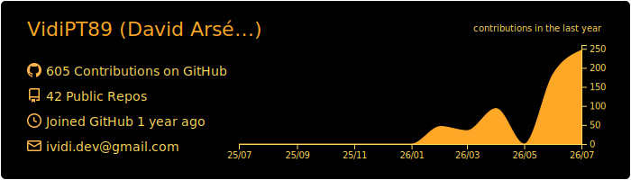
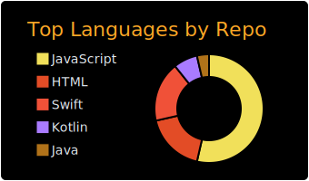
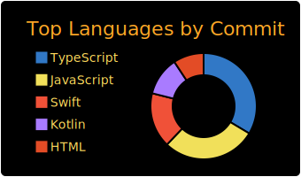
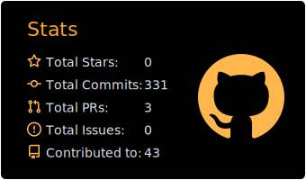
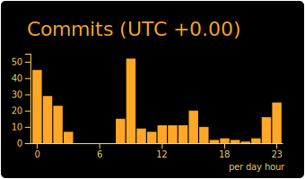

 

---

## About Me

I started in tech with a professional qualification in **IT Equipment Management** at Escola Profissional de Tecnologia Digital -- hardware, systems, infrastructure. Then I spent **16 years as a professional photographer**, with a Bachelor's in Photography and Visual Culture (Cinema) from IADE. That career built something software can't teach: an eye for detail, visual communication under pressure, and a relentless standard for quality.

When I decided it was time for a new challenge, I went all-in: **1050 hours** in a Software Developer programme at CESAE Digital, covering the full stack, including 400 hours of hands-on work experience.

> First, I learned how machines work.
> Then, I spent 16 years making images that told stories.
> Now I write code -- and I bring all of that with me.

**What that looks like in practice:**

| Area | Skills |
|---|---|
| Languages | Java, JavaScript, TypeScript, HTML & CSS |
| Development | OOP, Front-end & Back-end, React / Next.js / Node.js |
| Databases | SQL & NoSQL -- MySQL, MongoDB, Neon |
| Mobile | Android (Kotlin) & iOS (Swift) |
| Cloud & Deploy | Vercel, Cloudflare, Docker |
| Quality | QA, Design Patterns, UML |
| Management | Waterfall & Agile, Jira |

---

📷 Photography &nbsp;&middot;&nbsp; ✈️ Travelling &nbsp;&middot;&nbsp; 🌿 Nature &nbsp;&middot;&nbsp; 🎬 Films & Series &nbsp;&middot;&nbsp; ♟️ Chess &nbsp;&middot;&nbsp; 🧩 Sudoku

---

---

---

&nbsp;&nbsp;&nbsp;&nbsp;&nbsp;&nbsp;&nbsp;&nbsp;

&nbsp;&nbsp;&nbsp;&nbsp;

&nbsp;&nbsp;&nbsp;&nbsp;&nbsp;

&nbsp;&nbsp;&nbsp;

&nbsp;&nbsp;

&nbsp;&nbsp;&nbsp;&nbsp;

 

